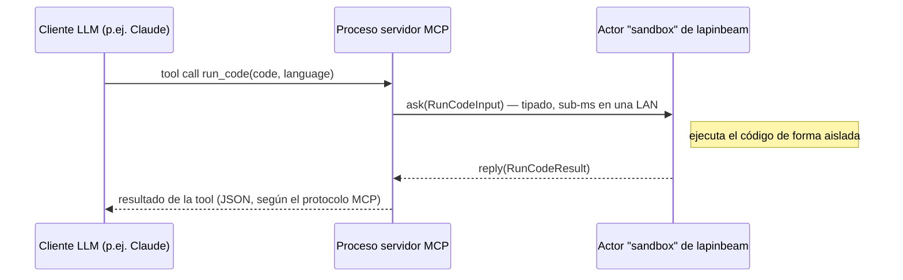
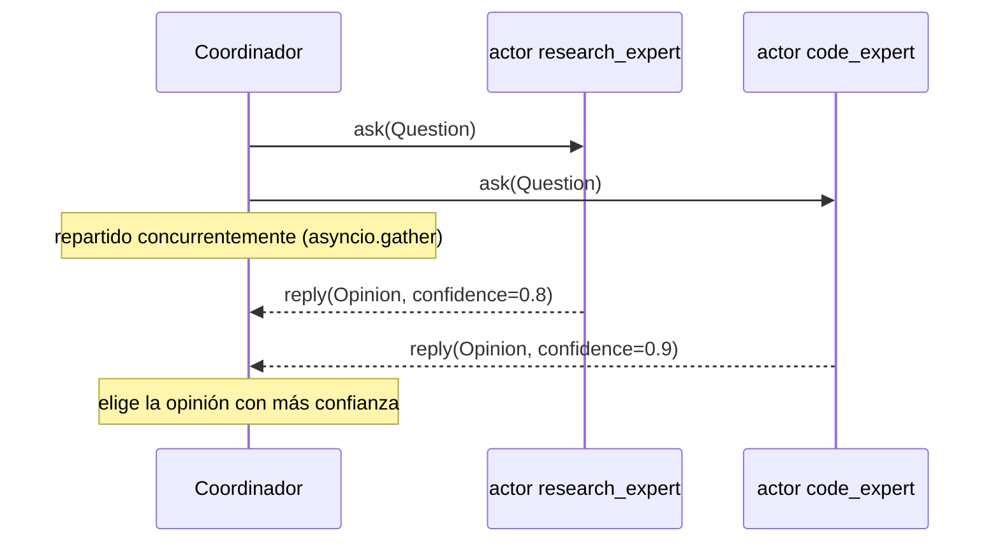

# Agentes de IA y servidores MCP

Dos patrones donde el modelo de actores de lapinbeam suele encajar
especialmente bien: despachar tool calls de MCP a procesos worker
especializados, y coordinar varios actores "expertos" respaldados por LLMs
que necesitan hablarse entre sí con latencia sub-milisegundo. Ambos se
apoyan en las mismas dos cosas ya cubiertas en el resto de esta
documentación — [payloads tipados](typed-messages.es.md) (los modelos
Pydantic hacen el roundtrip como ellos mismos, no como dicts) y
`ask()`/`current_message().reply()` para request/response — aplicadas a una
forma concreta de problema en vez de un ejemplo genérico.

!!! note "Ilustrativo, no un tutorial completo de MCP"
    El cableado específico de MCP de abajo (`MCPServer`, `@mcp.tool()`)
    muestra el punto de integración, no un servidor MCP completo — consulta
    el [SDK de Python de MCP](https://github.com/modelcontextprotocol/python-sdk)
    para eso. Se probó contra `mcp==2.0.0` (`pip install mcp`, la última
    versión en el momento de escribir esto): registrar la tool, listarla, y
    llamarla a través del propio `call_tool` de `MCPServer` llegan
    correctamente al actor de lapinbeam de abajo. Con un `mcp<2.0` fijado,
    esta clase se llamaba `FastMCP`, importable desde `mcp.server.fastmcp`
    — el SDK la renombró en la 2.0. Todo lo específico de lapinbeam (`Node`,
    `Supervisor`, `actor`, `ask`, `current_message`) es la API real y
    actual en cualquier caso.

## Despachar tool calls de MCP a workers especializados

Un servidor MCP es el proceso que habla de verdad con el cliente LLM
(Claude Desktop, Claude Code, ...); una tool que expone no tiene por qué
ejecutarse en el mismo proceso. Si una tool necesita un sandbox aislado, un
modelo residente en GPU, o un índice grande en memoria, eso es un nodo
separado al que el servidor MCP despacha — y como la llamada está en el
camino crítico de una sesión interactiva, un salto por un broker es
exactamente la latencia que no quieres pagar.



El nodo worker — un actor normal de lapinbeam, sin nada específico de MCP:

```python
from pydantic import BaseModel
from lapinbeam import Node, Supervisor, actor, on, current_message


class RunCodeInput(BaseModel):
    code: str
    language: str


class RunCodeResult(BaseModel):
    stdout: str
    stderr: str
    exit_code: int


@actor(name="sandbox")
class Sandbox:
    @on(RunCodeInput)
    async def run(self, msg: RunCodeInput):
        stdout, stderr, exit_code = await execute_in_sandbox(msg.code, msg.language)
        await current_message().reply(
            RunCodeResult(stdout=stdout, stderr=stderr, exit_code=exit_code)
        )


async def main():
    async with Node("sandbox@10.0.0.5:9101") as node:
        Supervisor(node=node).spawn(Sandbox)
        await node.wait_until_stopped()
```

El handler de la tool en el servidor MCP es una llamada `ask()` fina — el
trabajo real, y el aislamiento de proceso/recursos que necesite, vive
enteramente en el lado del worker:

```python
from mcp.server.mcpserver import MCPServer
from lapinbeam import Node, RemoteRef

mcp = MCPServer("sandbox-gateway")
node = Node("gateway@10.0.0.1:9100")
SANDBOX_PEER = "sandbox@10.0.0.5:9101"


@mcp.tool()
async def run_code(code: str, language: str) -> dict:
    """Ejecuta `code` en un sandbox aislado; devuelve stdout/stderr/exit_code."""
    remote: RemoteRef = node.get_remote_actor(SANDBOX_PEER, "sandbox")
    result: RunCodeResult = await remote.ask(RunCodeInput(code=code, language=language), timeout=10.0)
    return result.model_dump()


async def startup():
    await node.start()
    await node.connect_peer(SANDBOX_PEER)
```

Nada de esto es específico de un sandbox de código — la misma forma cubre
un índice de búsqueda vectorial, un modelo de embeddings local, o cualquier
tool cuyo trabajo real prefieras mantener fuera del propio proceso del
servidor MCP (distinto dominio de fallo, distinta máquina, necesidades de
escalado distintas).

## Coordinar varios actores expertos (mixture-of-experts)

Cuando más de un especialista podría razonablemente responder — un modelo
enfocado a investigación, uno enfocado a código, el reparto que tenga
sentido para tu caso — reparte una pregunta entre todos a la vez
(concurrentemente) y elige (o combina) los resultados. `ask()`, tanto en
`ActorRef` como en `RemoteRef`, hace que sea el mismo código tanto si los
expertos viven en el mismo proceso como repartidos por un clúster:



```python
import asyncio
from pydantic import BaseModel
from lapinbeam import ActorRef, Node, Supervisor, actor, current_message


class Question(BaseModel):
    text: str


class Opinion(BaseModel):
    expert: str
    answer: str
    confidence: float


@actor(name="research_expert")
class ResearchExpert:
    async def receive(self, msg: Question):
        answer = await call_research_model(msg.text)
        await current_message().reply(Opinion(expert="research", answer=answer, confidence=0.8))


@actor(name="code_expert")
class CodeExpert:
    async def receive(self, msg: Question):
        answer = await call_code_model(msg.text)
        await current_message().reply(Opinion(expert="code", answer=answer, confidence=0.9))


async def main():
    async with Node("experts@127.0.0.1:0") as node:
        sup = Supervisor(node=node)
        research_ref: ActorRef = sup.spawn(ResearchExpert)
        code_ref: ActorRef = sup.spawn(CodeExpert)

        question = Question(text="¿Por qué mi función recursiva revienta la pila?")
        opinions: list[Opinion] = await asyncio.gather(
            research_ref.ask(question, timeout=5.0),
            code_ref.ask(question, timeout=5.0),
        )
        best: Opinion = max(opinions, key=lambda o: o.confidence)
        print(f"Va con {best.expert}: {best.answer}")
```

Para repartir los expertos entre máquinas (cada uno con su propia GPU,
digamos), cambia `research_ref`/`code_ref` por
`node.get_remote_actor(peer_id, "research_expert")` — el código del
coordinador no cambia, ya que `ask()` es idéntico en `ActorRef` y en
`RemoteRef`.

Este ejemplo reparte una pregunta entre dos tipos de experto *distintos*.
Si en cambio repartes la misma pregunta (o un lote de preguntas) entre N
instancias *intercambiables* de un mismo experto — varios workers de
modelo idénticos compartiendo una cola, responde el que esté libre —
`Supervisor.spawn_pool()` encaja mejor que dos llamadas a `spawn()` más un
`gather()` a mano: `pool.map(preguntas)` envía cada pregunta y recoge cada
respuesta, en orden, en una sola llamada. Ver
[Concurrencia](getting-started.es.md#concurrencia-un-actor-procesa-un-mensaje-cada-vez)
para la API completa del pool (colas acotadas, particionado por clave, y
`executor="process"` para lo que sea CPU-bound en vez de I/O-bound como
estas llamadas `await` a un modelo).

## ¿Por qué no llamarlos por HTTP, o ponerlos detrás de un broker?

Puedes hacerlo — esta no es la única forma válida. El argumento a favor de
lapinbeam aquí es específicamente: son llamadas en el camino interactivo de
una sesión LLM (hay un usuario esperando), los payloads ya son objetos
Python tipados que prefieres no serializar a mano, y perder una llamada en
vuelo porque un proceso worker murió a mitad de la petición es un modo de
fallo aceptable (reintentar la tool call) en vez de algo que necesite una
cola duradera. Si algo de eso no se cumple — el trabajo debe sobrevivir a
un fallo, o el pool necesita más workers de los que un solo
proceso/máquina puede sostener — mira
[lapinbeam frente a Celery + RabbitMQ](vs-celery-rabbitmq.es.md); nada
impide usar ambos en el mismo sistema para las partes que de verdad lo
necesiten.

Vale la pena releer también, antes de meter cualquiera de estos dos
patrones en algo real, que estos ejemplos tienen las mismas
[Limitaciones](index.es.md#limitaciones) que el resto de lapinbeam: sin
persistencia de mensajes, mailboxes de actor sin límite a menos que fijes
`mailbox_capacity`, y payloads acotados a 16 MiB.
