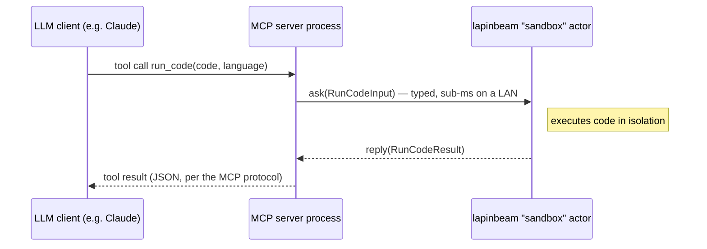
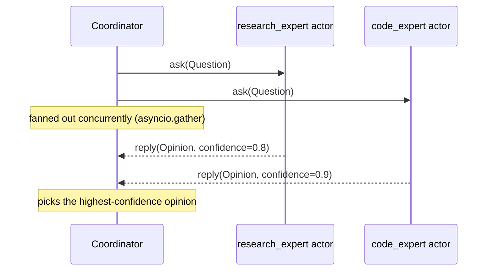

# AI agents & MCP servers

Two patterns where lapinbeam's actor model tends to fit particularly well:
dispatching MCP tool calls to specialized worker processes, and coordinating
several LLM-backed "expert" actors that need to talk to each other with
sub-millisecond latency. Both lean on the same two things covered elsewhere
in these docs — [typed payloads](typed-messages.md) (Pydantic models
round-trip as themselves, not dicts) and `ask()`/`current_message().reply()`
for request/response — applied to a concrete shape of problem instead of a
generic example.

!!! note "Illustrative, not a full MCP tutorial"
    The MCP-specific wiring below (`MCPServer`, `@mcp.tool()`) shows the
    integration point, not a complete MCP server — consult the
    [MCP Python SDK](https://github.com/modelcontextprotocol/python-sdk) for
    that. It was tested against `mcp==2.0.0` (`pip install mcp`, the latest
    release at the time of writing): registering the tool, listing it, and
    calling it through `MCPServer`'s own `call_tool` all correctly reach the
    lapinbeam actor below. On an older pinned `mcp<2.0`, this class was
    called `FastMCP`, importable from `mcp.server.fastmcp` — the SDK renamed
    it in 2.0. Everything lapinbeam-specific (`Node`, `Supervisor`, `actor`,
    `ask`, `current_message`) is the real, current API either way.

## Dispatching MCP tool calls to specialized workers

An MCP server is the process that actually talks to the LLM client (Claude
Desktop, Claude Code, ...); a tool call it exposes doesn't have to run
in-process. If a tool needs an isolated sandbox, a GPU-resident model, or a
large in-memory index, that's a separate node the MCP server dispatches to
— and since the call is on the hot path of an interactive session, a
broker hop is exactly the latency you don't want to pay.



The worker node — just a normal lapinbeam actor, nothing MCP-aware about it:

```python
from pydantic import BaseModel
from lapinbeam import Node, Supervisor, actor, on, current_message


class RunCodeInput(BaseModel):
    code: str
    language: str


class RunCodeResult(BaseModel):
    stdout: str
    stderr: str
    exit_code: int


@actor(name="sandbox")
class Sandbox:
    @on(RunCodeInput)
    async def run(self, msg: RunCodeInput):
        stdout, stderr, exit_code = await execute_in_sandbox(msg.code, msg.language)
        await current_message().reply(
            RunCodeResult(stdout=stdout, stderr=stderr, exit_code=exit_code)
        )


async def main():
    async with Node("sandbox@10.0.0.5:9101") as node:
        Supervisor(node=node).spawn(Sandbox)
        await node.wait_until_stopped()
```

The MCP server's tool handler is a thin `ask()` call — the actual work, and
any process/resource isolation it needs, lives entirely on the worker side:

```python
from mcp.server.mcpserver import MCPServer
from lapinbeam import Node

mcp = MCPServer("sandbox-gateway")
node = Node("gateway@10.0.0.1:9100")
SANDBOX_PEER = "sandbox@10.0.0.5:9101"


@mcp.tool()
async def run_code(code: str, language: str) -> dict:
    """Runs `code` in an isolated sandbox; returns stdout/stderr/exit_code."""
    remote = node.get_remote_actor(SANDBOX_PEER, "sandbox")
    result = await remote.ask(RunCodeInput(code=code, language=language), timeout=10.0)
    return result.model_dump()


async def startup():
    await node.start()
    await node.connect_peer(SANDBOX_PEER)
```

Nothing here is specific to a code sandbox — the same shape covers a vector
search index, a local embedding model, or any tool whose actual work you'd
rather keep off the MCP server's own process (different failure domain,
different machine, different scaling needs).

## Coordinating several expert actors (mixture-of-experts)

When more than one specialist could plausibly answer — a research-focused
model, a code-focused model, whatever the split is for your case — fan a
question out to all of them concurrently and pick (or merge) the results.
`ask()` on both `ActorRef` and `RemoteRef` makes this the same code whether
the experts live in the same process or across a cluster:



```python
import asyncio
from pydantic import BaseModel
from lapinbeam import Node, Supervisor, actor, current_message


class Question(BaseModel):
    text: str


class Opinion(BaseModel):
    expert: str
    answer: str
    confidence: float


@actor(name="research_expert")
class ResearchExpert:
    async def receive(self, msg: Question):
        answer = await call_research_model(msg.text)
        await current_message().reply(Opinion(expert="research", answer=answer, confidence=0.8))


@actor(name="code_expert")
class CodeExpert:
    async def receive(self, msg: Question):
        answer = await call_code_model(msg.text)
        await current_message().reply(Opinion(expert="code", answer=answer, confidence=0.9))


async def main():
    async with Node("experts@127.0.0.1:0") as node:
        sup = Supervisor(node=node)
        research_ref = sup.spawn(ResearchExpert)
        code_ref = sup.spawn(CodeExpert)

        question = Question(text="Why is my recursive function stack-overflowing?")
        opinions = await asyncio.gather(
            research_ref.ask(question, timeout=5.0),
            code_ref.ask(question, timeout=5.0),
        )
        best = max(opinions, key=lambda o: o.confidence)
        print(f"Going with {best.expert}: {best.answer}")
```

To spread the experts across machines (their own GPU each, say), swap
`research_ref`/`code_ref` for `node.get_remote_actor(peer_id, "research_expert")`
— the coordinator's code doesn't change, since `ask()` is identical on
`ActorRef` and `RemoteRef`.

## Why not just call these over HTTP, or put them behind a broker?

You can — this isn't the only valid shape. The case for lapinbeam here is
specifically: these are calls on the interactive path of an LLM session
(a user is waiting), the payloads are already typed Python objects you'd
rather not hand-serialize, and losing an in-flight call because a worker
process crashed mid-request is an acceptable failure mode (retry the tool
call) rather than something that needs a durable queue. If any of that
doesn't hold — the work must survive a crash, or you need a pool of
interchangeable workers auto-load-balancing — see
[lapinbeam vs. Celery + RabbitMQ](vs-celery-rabbitmq.md); nothing stops you
from using both in the same system for the parts that actually need it.

Also worth rereading before wiring either pattern into something real: these
examples run into the same [Limitations](index.md#limitations) as everything
else in lapinbeam — no message persistence, actor mailboxes unbounded unless
you set `mailbox_capacity`, and payloads capped at 16 MiB.
