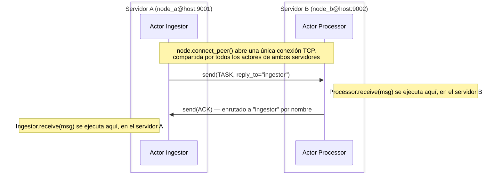

# Primeros pasos

## Instalación

```bash
pip install lapinbeam
```

Para desarrollar contra el propio código fuente en su lugar:

```bash
uv sync                       # crea .venv, compila la extensión Rust, instala deps
uv run maturin develop        # recompila la extensión tras tocar código Rust
uv run pytest                 # suite de tests en Python
cargo test                    # suite de tests en Rust
```

No se instala nada a nivel de sistema: todo vive en `.venv`.

## Conceptos clave

| Concepto | Qué es |
| --- | --- |
| `Node` | El extremo local del clúster: `nombre@host:puerto`. Posee el runtime de Tokio en segundo plano, el listener y las conexiones a peers. |
| `@actor` | Marca una clase como actor. `Supervisor.spawn` lee estos metadatos; no es un envoltorio de runtime. |
| `Supervisor` | Crea actores y los reinicia ante excepciones no controladas (estrategia `one_for_one`, con reinicios limitados y backoff). |
| `ActorRef` / `RemoteRef` | Un handle para enviar mensajes a un actor local o remoto. Ambos exponen el mismo `await ref.send(msg)`. |

## Un único actor

```python
import asyncio
from lapinbeam import ActorRef, Node, Supervisor, actor


@actor(name="echo")
class Echo:
    async def receive(self, msg):
        print("recibido:", msg)


async def main():
    node = Node("app@127.0.0.1:0")  # el puerto 0 elige uno efímero
    await node.start()

    sup = Supervisor(strategy="one_for_one", node=node)
    echo: ActorRef = sup.spawn(Echo)

    await echo.send({"hello": "world"})
    await asyncio.sleep(0.1)  # deja que la mailbox se vacíe antes de parar
    await node.stop()


asyncio.run(main())
```

`Node` también funciona como gestor de contexto asíncrono, la forma más
idiomática para cualquier cosa de vida más larga:

```python
async with Node("app@127.0.0.1:0") as node:
    sup = Supervisor(node=node)
    ref = sup.spawn(Echo)
    await ref.send({"hello": "world"})
    await asyncio.sleep(0.1)
# node.stop() se ejecuta automáticamente al salir, incluso si el bloque lanza una excepción.
```

`node.stop()` también cancela cualquier tarea de actor lanzada por
cualquier `Supervisor` en ese nodo — ninguna se queda corriendo para
siempre, bloqueada en un mailbox que nadie va a rellenar nunca. Para tirar
abajo solo los actores de un `Supervisor` en concreto en vez de todo el
nodo (p.ej. varios supervisores compartiendo un mismo nodo), llama
directamente a `await sup.shutdown()`.

## Dos nodos hablando entre sí

Esta es la demo de dos nodos de `examples/`, y lo único que merece la pena
dejar extra claro: **un `Node` es un servidor/proceso**, no un concepto que
viva solo en memoria. Abajo hay **dos scripts separados** —
`app_node_a.py` y `app_node_b.py` —, cada uno con solo el actor que ese
servidor necesita. No son dos ramas del mismo fichero: son dos ficheros,
pensados para correr como dos procesos `python` separados, potencialmente
en dos máquinas distintas.



El servidor A envía mensajes `TASK` al actor `processor` del servidor B; B
responde con `ACK` al actor que A haya indicado como `reply_to` — A no deja
fijo "responder a Ingestor", simplemente le dice a B a quién contestar, que
es justo lo que hace que el mismo código de `Processor` se pueda reutilizar
sin importar quién lo llame.

=== "app_node_a.py (servidor A)"

    ```python
    import asyncio
    import os
    from lapinbeam import Node, RemoteRef, Supervisor, actor


    # Este actor existe solo en el servidor A. Su trabajo es recibir el
    # ACK que el servidor B envía de vuelta una vez procesada una tarea.
    @actor(name="ingestor")
    class Ingestor:
        async def receive(self, msg):
            if msg.get("type") == "ACK":
                print("ack recibido para", msg["payload_id"])


    async def main():
        node_name = os.environ["NODE_NAME"]   # p.ej. node_a@127.0.0.1:9001 (este servidor)
        peer = os.environ["PEER"]             # p.ej. node_b@127.0.0.1:9002 (el otro servidor)

        node = Node(node_name)
        await node.start()   # vincula el socket de escucha de ESTE servidor
        sup = Supervisor(node=node)
        sup.spawn(Ingestor)                                # registra el actor que recibirá los ACK

        await node.connect_peer(peer)                      # marca al servidor B y espera el handshake TCP
        remote: RemoteRef = node.get_remote_actor(peer, "processor")  # una referencia al actor "processor" de B
        for i in range(100):
            # Cada send() de aquí cruza de verdad la red hasta el servidor B.
            await remote.send({"type": "TASK", "payload_id": i, "reply_to": "ingestor"})
            await asyncio.sleep(0.01)


    asyncio.run(main())
    ```

=== "app_node_b.py (servidor B)"

    ```python
    import asyncio
    import os
    from lapinbeam import Node, RemoteRef, Supervisor, actor


    # Este actor existe solo en el servidor B. Recibe los mensajes TASK
    # que envía el servidor A, y responde con un ACK — no a una dirección
    # fija, sino a cualquier nombre de actor que A haya puesto en
    # `reply_to`.
    @actor(name="processor")
    class Processor:
        def __init__(self, node_ref, peer_id):
            # `node_ref` es el propio Node de ESTE proceso (el del
            # servidor B) — se usa para enviar las respuestas. `peer_id`
            # es el id del OTRO servidor (el de A); ambos servidores ya
            # conocen la dirección del otro de antemano, gracias a las
            # variables de entorno NODE_NAME/PEER de abajo.
            self.node = node_ref
            self.peer_id = peer_id

        async def receive(self, msg):
            if msg.get("type") == "TASK":
                # get_remote_actor() NO abre una conexión nueva — solo
                # construye una referencia que reutiliza la única
                # conexión TCP ya establecida entre los dos servidores.
                remote: RemoteRef = self.node.get_remote_actor(self.peer_id, msg["reply_to"])
                await remote.send({"type": "ACK", "payload_id": msg["payload_id"]})


    async def main():
        node_name = os.environ["NODE_NAME"]   # p.ej. node_b@127.0.0.1:9002 (este servidor)
        peer = os.environ["PEER"]             # p.ej. node_a@127.0.0.1:9001 (el otro servidor)

        node = Node(node_name)
        await node.start()   # vincula el socket de escucha de ESTE servidor
        sup = Supervisor(node=node)
        sup.spawn(Processor, node, peer)   # registra el actor que responde a los TASK

        await node.wait_until_stopped()    # el servidor B solo reacciona a mensajes entrantes; nunca marca hacia fuera


    asyncio.run(main())
    ```

Fíjate en qué es igual y qué no: los dos scripts leen `NODE_NAME`/`PEER` del
entorno de la misma forma, pero no hay ninguna rama condicional en ningún
sitio — cada fichero solo desempeña un papel, exactamente igual que
`examples/app_node_a.py` y `examples/app_node_b.py`.

`Processor` recibe `peer_id` inyectado por su constructor porque es la
única forma que tiene de saber a qué nodo responder. Si un handler
prefiere averiguarlo a partir del propio mensaje en vez de depender de un
argumento del constructor, `lapinbeam.current_message()` lo devuelve
directamente:

```python
from lapinbeam import MessageMeta, RemoteRef, current_message

async def receive(self, msg):
    if msg.get("type") == "TASK":
        meta: MessageMeta | None = current_message()  # ¿quién envió esto, y a quién responder?
        remote: RemoteRef = self.node.get_remote_actor(meta.src, meta.reply_to)
        await remote.send({"type": "ACK", "payload_id": msg["payload_id"]})
```

`current_message()` devuelve un `MessageMeta(src, reply_to, correlation_id,
msg_id, node)` — poblado con lo que sea que el emisor haya pasado a
`send()` — mientras el propio handler que recibió `msg` sigue en ejecución,
y `None` fuera de uno (p.ej. desde una tarea en segundo plano que el propio
actor haya lanzado). Para un mensaje enviado por un actor local, `src` es
el id de este mismo nodo, y `msg_id` siempre es `None` (es un id por
conexión que el transporte solo asigna a mensajes remotos). `reply_to` y
`correlation_id` son `None` a menos que el emisor los indique:
`await ref.send(msg, reply_to="ingestor", correlation_id=7)`, tanto en
`ActorRef` como en `RemoteRef`.

Como responder a quien envió un mensaje — a `reply_to`, con el mismo
`correlation_id`, sea local o remoto — es lo bastante común como para
tener su propio atajo, el fragmento de arriba se puede escribir así:

```python
async def receive(self, msg):
    if msg.get("type") == "TASK":
        await current_message().reply({"type": "ACK", "payload_id": msg["payload_id"]})
```

`meta.reply(msg)` lanza `RuntimeError` si `meta.reply_to` es `None` —
nadie le dio una dirección de respuesta.

## Request/response con `ask()`

`send()` siempre es fire-and-forget — nada conecta una respuesta con el
envío que la provocó a menos que lo construyas tú mismo. `ask()` hace
justo eso: etiqueta el envío con un `correlation_id` nuevo, espera una
única respuesta, y funciona igual en `ActorRef` y en `RemoteRef`:

```python
respuesta: dict = await remote_processor.ask({"type": "TASK", "payload_id": 1})
```

El handler que recibe el mensaje sigue teniendo que responder de verdad —
`ask()` no cambia lo que hace un handler, solo cambia cómo espera quien
llama:

```python
@actor(name="processor")
class Processor:
    async def receive(self, msg):
        result = msg["payload_id"] * 2
        await current_message().reply({"type": "ACK", "result": result})
```

Si nada responde en `timeout` segundos (5 por defecto; `None` espera
indefinidamente), `ask()` lanza `TimeoutError`. Por debajo registra un
mailbox oculto de un solo uso como dirección de respuesta y lo limpia
después — no queda ningún actor ni recurso adicional persistente. Ver
[Agentes de IA y MCP](ai-agents.es.md) para un ejemplo trabajado: despachar
tool calls de MCP a un nodo worker, y repartir una pregunta entre varios
actores expertos concurrentemente.

Ejecútalos como dos procesos separados (ver [Ejemplos](examples.md) para
correr esto entre contenedores u hosts reales en vez de `127.0.0.1`):

```bash
# terminal 1
NODE_NAME=node_a@127.0.0.1:9001 PEER=node_b@127.0.0.1:9002 python app_node_a.py
# terminal 2
NODE_NAME=node_b@127.0.0.1:9002 PEER=node_a@127.0.0.1:9001 python app_node_b.py
```

## Observar el clúster

`connect_peer` ya espera a que el handshake se complete antes de devolver el
control, pero rara vez querrás volar a ciegas sobre el estado de la conexión
o los errores de entrega en un proceso de larga duración — suscríbete a los
eventos de sistema:

```python
def on_event(event: dict) -> None:
    if event["kind"] == "peer_disconnected":
        print("peer perdido:", event["peer"])
    elif event["kind"] == "error":
        print("error de entrega desde", event["peer"], ":", event["detail"],
              "correlation_id:", event["correlation_id"])
    elif event["kind"] == "decode_error":
        print("mensaje inválido para", event["actor"], ":", event["detail"])
    elif event["kind"] == "reconnect_gave_up":
        print("dejando de reintentar con:", event["peer"])
    elif event["kind"] == "supervisor_gave_up":
        print("actor detenido definitivamente:", event["actor"], ":", event["detail"])
    elif event["kind"] == "mailbox_full":
        print("mensaje descartado para:", event["actor"])

node.on_event(on_event)
```

`event["kind"]` es uno de `"peer_connected"`, `"peer_disconnected"`,
`"error"` (un peer reportó un fallo de entrega, p.ej. un mensaje enviado a
un nombre de actor que no existe en el nodo remoto — `event["correlation_id"]`
repite lo que sea que llevara el `send()` fallido, o `None`),
`"decode_error"` (un mensaje para un actor local no se pudo decodificar —
p.ej. un `ValidationError` de Pydantic sobre un payload mal formado — y se
descartó antes de llegar a la mailbox de ese actor, en vez de perderse en
una línea de log de asyncio sin relación aparente), `"reconnect_gave_up"`
(la reconexión automática a `event["peer"]` se abandonó tras
`reconnect_max_attempts` intentos fallidos — ya no se reintenta ni se
sigue rastreando, así que no queda ninguna fuga; llama a `connect_peer()`
de nuevo si quieres reintentarlo), o `"supervisor_gave_up"` (un
`Supervisor` dejó de reiniciar `event["actor"]` tras demasiados fallos
dentro de su ventana de reinicios — incluyendo un fallo en el propio
`__init__` del actor, no solo en sus handlers `receive`/`@on` — y ya no
sigue en ejecución), o `"mailbox_full"` (se descartó un mensaje para
`event["actor"]` porque su mailbox estaba lleno — solo posible si el
`Node` de ese actor se creó con `mailbox_capacity`; sin límite por
defecto, ver [Limitaciones](index.es.md#limitaciones)). Si ya sabes que no
necesitas más un peer, llama a `node.forget_peer(peer_id)` en vez de
esperar a que esto pase solo.

## Ajustar la detección de fallos y el backpressure

`Node(...)` acepta algunos parámetros más además de los ya vistos, todos
opcionales y con valores por defecto que mantienen el comportamiento
actual si no se indican:

```python
node = Node(
    "app@127.0.0.1:0",
    heartbeat_interval=1.0,     # cada cuánto hacer ping a cada peer
    peer_timeout=3.0,           # abandonar un peer que no ha enviado nada en este tiempo
    peer_queue_capacity=256,    # tramas salientes en cola por peer
    mailbox_capacity=None,      # límite del mailbox por actor; None = sin límite
)
```

`heartbeat_interval`/`peer_timeout` controlan cuán rápido se detecta un
peer silenciosamente caído — acortar `peer_timeout` sin acortar también
`heartbeat_interval` en *ambos* lados dará falsos positivos ante el jitter
normal de la red. `peer_queue_capacity` acota cuántas tramas salientes se
pueden encolar para un peer cuya escritura TCP está congestionada.
`mailbox_capacity` es el único que cambia de verdad el comportamiento por
defecto una vez que se fija — ver `"mailbox_full"` arriba.

Siguiente: [Mensajes tipados](typed-messages.md) para enviar tipos reales de
Python en vez de dicts, o [Benchmarks](benchmarks.md) para saber cuánto
cuesta esto en latencia y throughput.
