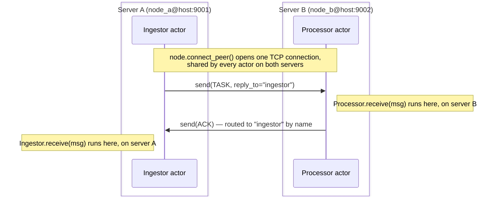

# Getting started

## Install

```bash
pip install lapinbeam
```

For local development against the source tree instead:

```bash
uv sync                       # create .venv, build the Rust extension, install deps
uv run maturin develop        # rebuild the extension after touching Rust code
uv run pytest                 # Python test suite
cargo test                    # Rust test suite
```

Nothing is installed system-wide: everything lives in `.venv`.

## Core concepts

| Concept | What it is |
| --- | --- |
| `Node` | The local endpoint of the cluster: `name@host:port`. Owns the background Tokio runtime, the listener, and peer connections. |
| `@actor` | Marks a class as an actor. `Supervisor.spawn` reads this metadata; it is not a runtime wrapper. |
| `Supervisor` | Spawns actors and restarts them on unhandled exceptions (`one_for_one` strategy, capped restarts with backoff). |
| `ActorRef` / `RemoteRef` | A handle to send messages to a local or remote actor. Both expose the same `await ref.send(msg)`. |

## A single actor

```python
import asyncio
from lapinbeam import Node, Supervisor, actor


@actor(name="echo")
class Echo:
    async def receive(self, msg):
        print("received:", msg)


async def main():
    node = Node("app@127.0.0.1:0")  # port 0 picks an ephemeral port
    await node.start()

    sup = Supervisor(strategy="one_for_one", node=node)
    echo = sup.spawn(Echo)

    await echo.send({"hello": "world"})
    await asyncio.sleep(0.1)  # let the mailbox drain before stopping
    await node.stop()


asyncio.run(main())
```

`Node` also works as an async context manager, which is the more idiomatic
shape for anything longer-lived:

```python
async with Node("app@127.0.0.1:0") as node:
    sup = Supervisor(node=node)
    ref = sup.spawn(Echo)
    await ref.send({"hello": "world"})
    await asyncio.sleep(0.1)
# node.stop() runs automatically on exit, even if the block raises.
```

## Two nodes talking to each other

This is the two-node demo in `examples/`, and the one thing worth being
extra explicit about: **a `Node` is one server/process**, not an in-memory
concept. Below are **two separate scripts** — `app_node_a.py` and
`app_node_b.py` — each with only the one actor that server needs. They are
not two branches of the same file: they are two files, meant to run as two
separate `python` processes, potentially on two separate machines.



Server A sends `TASK` messages to the `processor` actor on server B; B
replies with `ACK` to whichever actor A named as `reply_to` — A doesn't hard-code
"reply to Ingestor", it just tells B who to answer, which is what makes the
same `Processor` code reusable no matter who calls it.

=== "app_node_a.py (server A)"

    ```python
    import asyncio
    import os
    from lapinbeam import Node, Supervisor, actor


    # This actor exists only on server A. Its job is to receive the ACK
    # that server B sends back once it has processed a task.
    @actor(name="ingestor")
    class Ingestor:
        async def receive(self, msg):
            if msg.get("type") == "ACK":
                print("got ack for", msg["payload_id"])


    async def main():
        node_name = os.environ["NODE_NAME"]   # e.g. node_a@127.0.0.1:9001 (this server)
        peer = os.environ["PEER"]             # e.g. node_b@127.0.0.1:9002 (the other server)

        node = Node(node_name)
        await node.start()   # binds the listening socket for THIS server
        sup = Supervisor(node=node)
        sup.spawn(Ingestor)                                # register the actor that will receive ACKs

        await node.connect_peer(peer)                      # dial server B and wait for the TCP handshake
        remote = node.get_remote_actor(peer, "processor")  # a handle to B's "processor" actor
        for i in range(100):
            # Every send() here actually crosses the network to server B.
            await remote.send({"type": "TASK", "payload_id": i, "reply_to": "ingestor"})
            await asyncio.sleep(0.01)


    asyncio.run(main())
    ```

=== "app_node_b.py (server B)"

    ```python
    import asyncio
    import os
    from lapinbeam import Node, Supervisor, actor


    # This actor exists only on server B. It receives TASK messages sent
    # by server A, and replies with an ACK — not to a hard-coded address,
    # but to whichever actor name server A put in `reply_to`.
    @actor(name="processor")
    class Processor:
        def __init__(self, node_ref, peer_id):
            # `node_ref` is THIS process's own Node (server B's) — used to
            # send replies back out. `peer_id` is the OTHER server's id
            # (server A's); both servers already know each other's address
            # up front, from the NODE_NAME/PEER environment variables below.
            self.node = node_ref
            self.peer_id = peer_id

        async def receive(self, msg):
            if msg.get("type") == "TASK":
                # get_remote_actor() does NOT open a new connection — it
                # just builds a reference that reuses the one TCP
                # connection already established between the two servers.
                remote = self.node.get_remote_actor(self.peer_id, msg["reply_to"])
                await remote.send({"type": "ACK", "payload_id": msg["payload_id"]})


    async def main():
        node_name = os.environ["NODE_NAME"]   # e.g. node_b@127.0.0.1:9002 (this server)
        peer = os.environ["PEER"]             # e.g. node_a@127.0.0.1:9001 (the other server)

        node = Node(node_name)
        await node.start()   # binds the listening socket for THIS server
        sup = Supervisor(node=node)
        sup.spawn(Processor, node, peer)   # register the actor that answers TASKs

        await node.wait_until_stopped()    # server B only reacts to incoming messages; it never dials out


    asyncio.run(main())
    ```

Note what's identical and what isn't: both scripts read `NODE_NAME`/`PEER`
from the environment the same way, but there's no branching logic anywhere
— each file only ever plays one role, matching `examples/app_node_a.py` and
`examples/app_node_b.py` exactly.

Run them as two separate processes (see
[Examples](examples.md) for running this across containers or real hosts
instead of `127.0.0.1`):

```bash
# terminal 1
NODE_NAME=node_a@127.0.0.1:9001 PEER=node_b@127.0.0.1:9002 python app_node_a.py
# terminal 2
NODE_NAME=node_b@127.0.0.1:9002 PEER=node_a@127.0.0.1:9001 python app_node_b.py
```

## Observing the cluster

`connect_peer` already waits for the handshake to complete before returning,
but you rarely want to fly blind about connection state or delivery errors in
a long-running process — subscribe to system events:

```python
def on_event(event):
    if event["kind"] == "peer_disconnected":
        print("lost peer:", event["peer"])
    elif event["kind"] == "error":
        print("delivery error from", event["peer"], ":", event["detail"])
    elif event["kind"] == "decode_error":
        print("bad message for", event["actor"], ":", event["detail"])

node.on_event(on_event)
```

`event["kind"]` is one of `"peer_connected"`, `"peer_disconnected"`,
`"error"` (a peer reported a delivery failure, e.g. a message sent to an
actor name that does not exist on the remote node), or `"decode_error"` (a
message for a local actor failed to decode — e.g. a Pydantic
`ValidationError` on a malformed payload — and was dropped before ever
reaching that actor's mailbox, instead of vanishing into an unrelated
asyncio log line).

Next: [Typed messages](typed-messages.md) for sending real Python types
instead of dicts, or [Benchmarks](benchmarks.md) for what this costs you in
latency and throughput.
