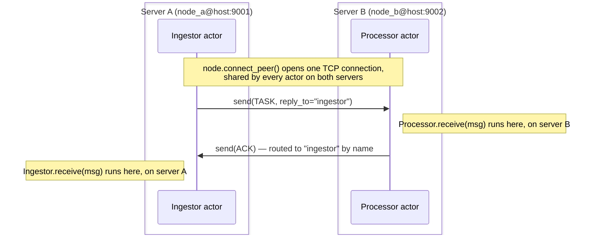

# Getting started

## Install

```bash
pip install lapinbeam
```

For local development against the source tree instead:

```bash
uv sync                       # create .venv, build the Rust extension, install deps
uv run maturin develop        # rebuild the extension after touching Rust code
uv run pytest                 # Python test suite
cargo test                    # Rust test suite
```

Nothing is installed system-wide: everything lives in `.venv`.

## Core concepts

| Concept | What it is |
| --- | --- |
| `Node` | The local endpoint of the cluster: `name@host:port`. Owns the background Tokio runtime, the listener, and peer connections. |
| `@actor` | Marks a class as an actor. `Supervisor.spawn` reads this metadata; it is not a runtime wrapper. |
| `Supervisor` | Spawns actors and restarts them on unhandled exceptions (`one_for_one` strategy, capped restarts with backoff). |
| `ActorRef` / `RemoteRef` | A handle to send messages to a local or remote actor. Both expose the same `await ref.send(msg)`. |

## A single actor

```python
import asyncio
from lapinbeam import ActorRef, Node, Supervisor, actor


@actor(name="echo")
class Echo:
    async def receive(self, msg):
        print("received:", msg)


async def main():
    node = Node("app@127.0.0.1:0")  # port 0 picks an ephemeral port
    await node.start()

    sup = Supervisor(strategy="one_for_one", node=node)
    echo: ActorRef = sup.spawn(Echo)

    await echo.send({"hello": "world"})
    await asyncio.sleep(0.1)  # let the mailbox drain before stopping
    await node.stop()


asyncio.run(main())
```

`Node` also works as an async context manager, which is the more idiomatic
shape for anything longer-lived:

```python
async with Node("app@127.0.0.1:0") as node:
    sup = Supervisor(node=node)
    ref = sup.spawn(Echo)
    await ref.send({"hello": "world"})
    await asyncio.sleep(0.1)
# node.stop() runs automatically on exit, even if the block raises.
```

`node.stop()` also cancels every actor task spawned by any `Supervisor` on
that node — none are left running forever, blocked on a mailbox nothing
will ever fill again. To tear down only one `Supervisor`'s actors instead
of the whole node (e.g. multiple supervisors sharing one node), call
`await sup.shutdown()` directly.

## Concurrency: one actor handles one message at a time

Every actor has exactly one mailbox and exactly one task reading from
it, in a loop: pull a message, run the handler, wait for it to finish,
pull the next one. `send()` doesn't change that — it only queues the
message and returns immediately, regardless of how many you fire off:

```python
import asyncio
from lapinbeam import ActorRef, Node, Supervisor, actor


@actor(name="processor")
class Processor:
    async def receive(self, msg):
        await asyncio.sleep(1)  # e.g. a slow downstream call
        print("done with", msg["id"])


async def main():
    async with Node("app@127.0.0.1:0") as node:
        sup = Supervisor(node=node)
        ref: ActorRef = sup.spawn(Processor)
        for i in range(5):
            await ref.send({"id": i})  # each returns instantly...
        await asyncio.sleep(6)          # ...but this actor still needs ~5s total
```

All five `send()` calls return in a fraction of a second, but `Processor`
finishes them one at a time — the fifth one lands at roughly the 5-second
mark, not the first. This is deliberate, not a limitation: since only one
message is ever "in flight" inside a given actor, handler code can read
and write `self.whatever` freely, with no locks — the same guarantee
Erlang processes make.

If you want several such calls to actually run at once, spawn a **pool**
of actors instead of expecting one actor to parallelize itself.
`Supervisor.spawn_pool()` does exactly that — `n_workers` actors created
once, sharing one internal queue, whichever is free next picking up the
next message:

```python
from lapinbeam import PoolRef


async def process(msg):
    await asyncio.sleep(1)
    print("done with", msg["id"])


async def main():
    async with Node("app@127.0.0.1:0") as node:
        sup = Supervisor(node=node)
        pool: PoolRef = await sup.spawn_pool(process, 5, name="processors")
        for i in range(5):
            await pool.send({"id": i})
        await asyncio.sleep(2)  # now ~1s total, not ~5s
```

Each pooled actor has its own mailbox and its own task, so their five
`asyncio.sleep(1)` calls genuinely overlap — all five finish around the
1-second mark instead of the 5-second one. `current_message()`/`.reply()`
and `ask()`/`ask_stream()` sent to `pool` work exactly as they would
against an ordinary `spawn()`ed actor, no matter which worker ends up
answering. A `process` that raises doesn't crash its worker — it's caught
internally and reported via `on_event(kind="pool_worker_error")`, and
that worker picks up the next queued message.

`process` above is a plain function, so the workers are stateless between
calls. If each worker should keep its own state across the messages it
happens to pick up (a cache, a counter, a connection), pass an `@actor`
class instead — `spawn_pool()` builds one instance per worker (`args`/
`kwargs` go to its constructor, exactly like `spawn()`) and dispatches
each message through that instance's own `@on` handlers, or `receive` if
it defines no `@on` at all:

```python
from lapinbeam import PoolRef, actor


@actor(name="processor")
class Processor:
    def __init__(self):
        self.handled = 0

    async def receive(self, msg):
        await asyncio.sleep(1)
        self.handled += 1
        print("done with", msg["id"], "— this worker's handled", self.handled)


async def main():
    async with Node("app@127.0.0.1:0") as node:
        sup = Supervisor(node=node)
        pool: PoolRef = await sup.spawn_pool(Processor, 5, name="processors")
        for i in range(5):
            await pool.send({"id": i})
        await asyncio.sleep(2)
```

Same queue, same concurrency, same `on_event(kind="pool_worker_error")`
safety net — but now each of the 5 `Processor` instances keeps `handled`
across every message *that instance* ends up processing. That safety net
matters more here than with a function: if a handler raises, the *same*
instance keeps running afterward, so any half-updated `self` state stays
half-updated for the next message that worker picks up (unlike a
`spawn()`ed actor's crash, which gets a fresh instance on restart).

**When to reach for `spawn_pool()`**: work items arrive faster than one
actor could get through them, but each item is cheap enough (or I/O-bound
enough — see the warning below) that a handful of workers keep up, and
you don't care *which* worker handles a given item — pick the function
form for stateless work, the class form when workers should keep state
across messages. **When not to**: if you need to wait for *several*
independent replies at once rather than one pool answering one `ask()`,
`asyncio.gather()` over several `ask()` calls (pool or not) is the tool —
see the mixture-of-experts pattern in [AI agents & MCP](ai-agents.md).

### Backpressure: bounding the pool's queue

By default the pool's internal queue is unbounded — if `pool.send()` is
called faster than the workers can drain it, the queue just keeps
growing. Pass `queue_capacity` to cap it, same convention as
`Node(mailbox_capacity=...)`: once it's full, a further `send()` is
dropped and reported via `on_event(kind="pool_queue_full")` instead of
consuming unbounded memory:

```python
pool = await sup.spawn_pool(process, 5, name="processors", queue_capacity=1000)
```

### Per-key ordering: sharded pools

The default routing is "whichever worker is free next" — good for
throughput, but it gives no ordering guarantee between two messages for
the same logical entity (e.g. two updates for the same `order_id` could
be picked up out of order by two different workers). Pass `key` to shard
the pool instead: each worker gets its *own* queue, and every message
with the same key always lands on the same worker, in arrival order,
while different keys still run in parallel:

```python
pool: PoolRef = await sup.spawn_pool(
    process, 5, name="processors", key=lambda msg: msg["order_id"]
)
```

Now every message for `order_id=42` is handled by one specific worker, in
order, while `order_id=43` runs concurrently on a different one. The
tradeoff: an uneven key distribution (a handful of very "hot" keys) can
leave some workers idle while others queue up — this isn't the tool for
balancing raw throughput, only for the cases where ordering matters more
than perfectly even load.

!!! warning "This parallelism is for I/O-bound work, not CPU-bound work — unless you ask for an executor"
    A pool helps because `await asyncio.sleep(...)` (or a network call, or
    any other `await` that actually yields control) lets asyncio interleave
    every actor's wait on the same thread. It does **not** help a handler
    that's doing real, synchronous CPU work with no `await` in it at all —
    Python's asyncio event loop is single-threaded, so N actors all
    crunching numbers still run one after another, exactly as slow as N
    sequential calls inside one actor.

    For genuinely CPU-bound work, pass `executor="process"` (or
    `"thread"`, for a blocking call that isn't CPU-bound but has no async
    equivalent, e.g. a synchronous C library or DB driver) — `handler`
    must then be a plain **synchronous** function, run off the event loop
    in a real `ProcessPoolExecutor`/`ThreadPoolExecutor` sized to
    `n_workers`. Its return value is sent back automatically if the
    message came in through `ask()`/`ask_stream()`:

    ```python
    def crunch(msg):          # plain def, not async def
        return sum(i * i for i in range(msg["n"]))


    async def main():
        async with Node("app@127.0.0.1:0") as node:
            sup = Supervisor(node=node)
            pool = await sup.spawn_pool(crunch, 4, name="crunchers", executor="process")
            result = await pool.ask({"n": 10_000_000})


    if __name__ == "__main__":     # required for executor="process" — see below
        asyncio.run(main())
    ```

    `executor="process"` doesn't support an `@actor` class `handler` —
    there's no way to keep Python state on `self` across a process
    boundary — and requires `handler` plus every message/`args`/`kwargs`
    it's called with to be picklable (a module-level function, not a
    closure or lambda). It also inherits the standard `multiprocessing`
    requirement that the entry script guard its top-level code with
    `if __name__ == "__main__":` — without it, a worker process re-imports
    the script as `__main__` and re-runs everything at module scope
    (including `asyncio.run(main())` itself), which at best duplicates
    work and at worst hangs. `executor="thread"` has no such restriction —
    it shares the parent process instead of spawning new ones. An
    alternative that sidesteps both constraints:
    split the work across separate OS processes yourself — several
    lapinbeam `Node`s, possibly on different machines, talking over the
    network the same way the two-node example below does.

## Two nodes talking to each other

This is the two-node demo in `examples/`, and the one thing worth being
extra explicit about: **a `Node` is one server/process**, not an in-memory
concept. Below are **two separate scripts** — `app_node_a.py` and
`app_node_b.py` — each with only the one actor that server needs. They are
not two branches of the same file: they are two files, meant to run as two
separate `python` processes, potentially on two separate machines.



Server A sends `TASK` messages to the `processor` actor on server B; B
replies with `ACK` to whichever actor A named as `reply_to` — A doesn't hard-code
"reply to Ingestor", it just tells B who to answer, which is what makes the
same `Processor` code reusable no matter who calls it.

=== "app_node_a.py (server A)"

    ```python
    import asyncio
    import os
    from lapinbeam import Node, RemoteRef, Supervisor, actor


    # This actor exists only on server A. Its job is to receive the ACK
    # that server B sends back once it has processed a task.
    @actor(name="ingestor")
    class Ingestor:
        async def receive(self, msg):
            if msg.get("type") == "ACK":
                print("got ack for", msg["payload_id"])


    async def main():
        node_name = os.environ["NODE_NAME"]   # e.g. node_a@127.0.0.1:9001 (this server)
        peer = os.environ["PEER"]             # e.g. node_b@127.0.0.1:9002 (the other server)

        node = Node(node_name)
        await node.start()   # binds the listening socket for THIS server
        sup = Supervisor(node=node)
        sup.spawn(Ingestor)                                # register the actor that will receive ACKs

        await node.connect_peer(peer)                      # dial server B and wait for the TCP handshake
        remote: RemoteRef = node.get_remote_actor(peer, "processor")  # a handle to B's "processor" actor
        for i in range(100):
            # Every send() here actually crosses the network to server B.
            await remote.send({"type": "TASK", "payload_id": i, "reply_to": "ingestor"})
            await asyncio.sleep(0.01)


    asyncio.run(main())
    ```

=== "app_node_b.py (server B)"

    ```python
    import asyncio
    import os
    from lapinbeam import Node, RemoteRef, Supervisor, actor


    # This actor exists only on server B. It receives TASK messages sent
    # by server A, and replies with an ACK — not to a hard-coded address,
    # but to whichever actor name server A put in `reply_to`.
    @actor(name="processor")
    class Processor:
        def __init__(self, node_ref, peer_id):
            # `node_ref` is THIS process's own Node (server B's) — used to
            # send replies back out. `peer_id` is the OTHER server's id
            # (server A's); both servers already know each other's address
            # up front, from the NODE_NAME/PEER environment variables below.
            self.node = node_ref
            self.peer_id = peer_id

        async def receive(self, msg):
            if msg.get("type") == "TASK":
                # get_remote_actor() does NOT open a new connection — it
                # just builds a reference that reuses the one TCP
                # connection already established between the two servers.
                remote: RemoteRef = self.node.get_remote_actor(self.peer_id, msg["reply_to"])
                await remote.send({"type": "ACK", "payload_id": msg["payload_id"]})


    async def main():
        node_name = os.environ["NODE_NAME"]   # e.g. node_b@127.0.0.1:9002 (this server)
        peer = os.environ["PEER"]             # e.g. node_a@127.0.0.1:9001 (the other server)

        node = Node(node_name)
        await node.start()   # binds the listening socket for THIS server
        sup = Supervisor(node=node)
        sup.spawn(Processor, node, peer)   # register the actor that answers TASKs

        await node.wait_until_stopped()    # server B only reacts to incoming messages; it never dials out


    asyncio.run(main())
    ```

Note what's identical and what isn't: both scripts read `NODE_NAME`/`PEER`
from the environment the same way, but there's no branching logic anywhere
— each file only ever plays one role, matching `examples/app_node_a.py` and
`examples/app_node_b.py` exactly.

`Processor` above gets `peer_id` injected through its constructor because
that's the only way it can know which node to reply to. If a handler would
rather find that out from the message itself instead of relying on a
constructor argument, `lapinbeam.current_message()` returns it directly:

```python
from lapinbeam import MessageMeta, RemoteRef, current_message

async def receive(self, msg):
    if msg.get("type") == "TASK":
        meta: MessageMeta | None = current_message()  # who sent this, and to what?
        remote: RemoteRef = self.node.get_remote_actor(meta.src, meta.reply_to)
        await remote.send({"type": "ACK", "payload_id": msg["payload_id"]})
```

`current_message()` returns a `MessageMeta(src, reply_to, correlation_id,
msg_id, node)` — populated from whatever the sender passed to `send()` —
for as long as the handler coroutine that received `msg` is running, and
`None` outside of one (e.g. from a background task an actor spawned
itself). For a message sent by a local actor, `src` is this node's own id,
and `msg_id` is always `None` (it's a per-connection id the transport
assigns to remote messages only). `reply_to` and `correlation_id` are
`None` unless the sender set them: `await ref.send(msg, reply_to="ingestor",
correlation_id=7)`, on both `ActorRef` and `RemoteRef`.

Since replying to whoever sent a message — to `reply_to`, tagged with the
same `correlation_id`, whether they were local or remote — is common enough
to have its own shortcut, the snippet above can be written as:

```python
async def receive(self, msg):
    if msg.get("type") == "TASK":
        await current_message().reply({"type": "ACK", "payload_id": msg["payload_id"]})
```

`meta.reply(msg)` raises `RuntimeError` if `meta.reply_to` is `None` — there's
nothing sent it a return address to reply to.

## Request/response with `ask()`

`send()` is always fire-and-forget — nothing ties a reply back to the send
that provoked it unless you build that yourself. `ask()` does exactly that:
it tags the send with a fresh `correlation_id`, waits for a single reply,
and works the same on `ActorRef` and `RemoteRef`:

```python
reply: dict = await remote_processor.ask({"type": "TASK", "payload_id": 1})
```

The receiving handler still has to actually reply — `ask()` doesn't change
what a handler does, it only changes how the *caller* waits:

```python
@actor(name="processor")
class Processor:
    async def receive(self, msg):
        result = msg["payload_id"] * 2
        await current_message().reply({"type": "ACK", "result": result})
```

If nothing replies within `timeout` seconds (5 by default; `None` waits
forever), `ask()` raises `TimeoutError`. Under the hood it registers a
one-shot hidden mailbox as the reply address and cleans it up afterwards —
there's no persistent extra actor or resource left behind. See
[AI agents & MCP](ai-agents.md) for a worked example: dispatching MCP tool
calls to a worker node, and fanning a question out to several expert actors
concurrently.

## Streaming replies with `ask_stream()`

`ask()` is for a handler that computes one answer. When the handler needs
to report *progress* along the way — a long job with several steps, each
worth showing before the final result — `ask_stream()` is the same idea,
repeated: the handler calls `current_message().reply_stream()` as many
times as it likes, then `reply_final()` exactly once, and the caller reads
them all as they arrive:

```python
@actor(name="importer")
class Importer:
    async def receive(self, msg):
        for row in msg["rows"]:
            await do_slow_import(row)
            await current_message().reply_stream({"imported": row["id"]})
        await current_message().reply_final({"status": "done"})


async def watch_import(ref, rows):
    async for update in ref.ask_stream({"rows": rows}, timeout=None):
        print(update)  # {"imported": ...} a few times, then {"status": "done"}
```

`timeout` (5s by default, same as `ask()`) applies *per item* here, not to
the whole stream — the clock resets after every `reply_stream()`/
`reply_final()`, so a handler that's still actively working never times
out just because the total job runs long; it only times out if it goes
quiet for `timeout` seconds. Works the same on `ActorRef`, `RemoteRef`,
and a `Supervisor.spawn_pool()` `PoolRef` — whichever worker ends up
handling the message is the one whose replies you see.

**When to reach for it**: any time the caller genuinely wants to observe
progress, not just wait for a single answer — piping updates into a
progress bar, a log, or (the common case) a Server-Sent Events response in
a web handler. **When not to**: if you only care about the final result,
plain `ask()` is simpler and doesn't require the handler to remember to
call `reply_final()`. And `ask_stream()` only ever delivers to whoever
called it — if *several* independent watchers need the same live updates
(e.g. more than one browser tab open on the same in-flight job), fan-out
across them is your job, not `ask_stream()`'s: have one task call
`ask_stream()` and relay each update into a small local pub/sub the other
watchers subscribe to, instead of each one calling `ask_stream()`
separately. `examples/order_stream/` is exactly this: one relay task per
order, feeding as many open SSE connections as happen to be watching it.

Run them as two separate processes (see
[Examples](examples.md) for running this across containers or real hosts
instead of `127.0.0.1`):

```bash
# terminal 1
NODE_NAME=node_a@127.0.0.1:9001 PEER=node_b@127.0.0.1:9002 python app_node_a.py
# terminal 2
NODE_NAME=node_b@127.0.0.1:9002 PEER=node_a@127.0.0.1:9001 python app_node_b.py
```

## Observing the cluster

`connect_peer` already waits for the handshake to complete before returning,
but you rarely want to fly blind about connection state or delivery errors in
a long-running process — subscribe to system events:

```python
def on_event(event: dict) -> None:
    if event["kind"] == "peer_disconnected":
        print("lost peer:", event["peer"])
    elif event["kind"] == "error":
        print("delivery error from", event["peer"], ":", event["detail"],
              "correlation_id:", event["correlation_id"])
    elif event["kind"] == "decode_error":
        print("bad message for", event["actor"], ":", event["detail"])
    elif event["kind"] == "reconnect_gave_up":
        print("giving up on peer:", event["peer"])
    elif event["kind"] == "supervisor_gave_up":
        print("actor stopped for good:", event["actor"], ":", event["detail"])
    elif event["kind"] == "mailbox_full":
        print("dropped a message for:", event["actor"])

node.on_event(on_event)
```

`event["kind"]` is one of `"peer_connected"`, `"peer_disconnected"`,
`"error"` (a peer reported a delivery failure, e.g. a message sent to an
actor name that does not exist on the remote node — `event["correlation_id"]`
echoes whatever the failed `send()` was tagged with, or `None`),
`"decode_error"` (a message for a local actor failed to decode — e.g. a
Pydantic `ValidationError` on a malformed payload — and was dropped before
ever reaching that actor's mailbox, instead of vanishing into an unrelated
asyncio log line), `"reconnect_gave_up"` (automatic reconnection to
`event["peer"]` was abandoned after `reconnect_max_attempts` failed
attempts — it's no longer retried or tracked, so it's not a leak left
behind; call `connect_peer()` again if you want to retry), or
`"supervisor_gave_up"` (a `Supervisor` stopped restarting `event["actor"]`
after too many crashes within its restart window — including a crash in the
actor's own `__init__`, not only its `receive`/`@on` handlers — and it is
no longer running), or `"mailbox_full"` (a message for `event["actor"]` was
dropped because its mailbox was full — only possible if that actor's
`Node` was created with `mailbox_capacity` set; unbounded by default, see
[Limitations](index.md#limitations)). If you already know you're done with
a peer, call `node.forget_peer(peer_id)` instead of waiting for that to
happen on its own.

## Tuning failure detection and backpressure

`Node(...)` takes a few more knobs beyond what's shown above, all optional
and all defaulting to today's behavior if left unset:

```python
node = Node(
    "app@127.0.0.1:0",
    heartbeat_interval=1.0,     # how often to ping each peer
    peer_timeout=3.0,           # drop a peer that's sent nothing for this long
    peer_queue_capacity=256,    # outbound frames buffered per peer
    mailbox_capacity=None,      # cap per-actor mailbox size; None = unbounded
)
```

`heartbeat_interval`/`peer_timeout` control how quickly a silently-dead peer
is noticed — shortening `peer_timeout` without also shortening
`heartbeat_interval` on *both* sides will false-positive on ordinary network
jitter. `peer_queue_capacity` bounds how many outbound frames can be queued
for a peer whose TCP write is congested. `mailbox_capacity` is the one
that changes default behavior in a real way once set — see
`"mailbox_full"` above.

Next: [Typed messages](typed-messages.md) for sending real Python types
instead of dicts, [OTP-inspired patterns](otp-patterns.md) for supervision
trees, links, monitors, groups, and cluster-wide name registration, or
[Benchmarks](benchmarks.md) for what this costs you in latency and
throughput.
